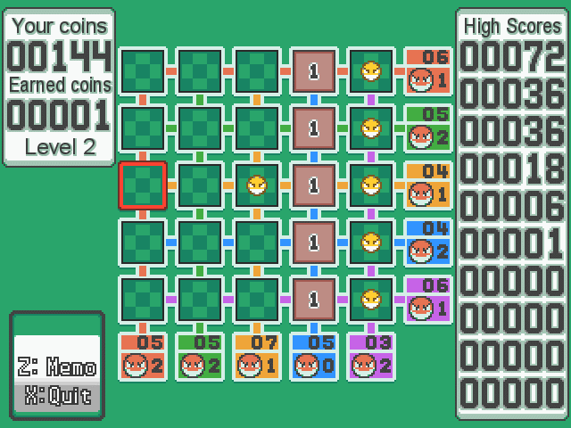
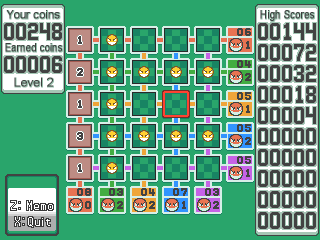

# Voltorb Flip
This script is for RPG Maker XP. The Pokémon HeartGold/SoulSilver minigame, a cross between Picross and Minesweeper.

## Screens

## Installation
Copy the [Script](/Script.rb) above main. Drag the content of [Files folder](/Files) to your project main folder.

## Instructions
Run with 

    $scene = Scene_VoltorbFlip.new